<!-- Improved compatibility of back to top link: See: https://github.com/othneildrew/Best-README-Template/pull/73 -->
<a name="readme-top"></a>

<div align="center">
    <!-- PROJECT SHIELDS -->
<a href="https://github.com/sara-hines/social-media-startup-api/graphs/contributors">
        
    </a>
    <a href="https://github.com/sara-hines/social-media-startup-api/network/members">
        
    </a>
    <a href="https://github.com/sara-hines/social-media-startup-api/stargazers">
        
    </a>
    <a href="https://github.com/sara-hines/social-media-startup-api/issues">
        
    </a>
    <a href="https://github.com/sara-hines/social-media-startup-api/blob/master/LICENSE.txt">
        
    </a>
</div>


<br />
<div align="center">

<h3 align="center">Social Media Startup API</h3>

  <p align="center">
    Working with Unstructured Data in MongoDB
    <br />
    <br />
    <a href="https://github.com/sara-hines/social-media-startup-api"><strong>Explore the docs »</strong></a>
    <br />
    <br />
    <a href="https://drive.google.com/file/d/14mfIR_051DTd24HeEsaBhJFvdu30IYW7/view?usp=sharing">View Walkthrough Video</a>
    ·
    <a href="https://github.com/sara-hines/social-media-startup-api/issues/new?labels=bug&template=bug-report---.md">Report a Bug</a>
    ·
    <a href="https://github.com/sara-hines/social-media-startup-api/issues/new?labels=enhancement&template=feature-request---.md">Request a Feature</a>
  </p>
</div>

<br />
<!-- TABLE OF CONTENTS -->
<details>
  <summary>Table of Contents</summary>
  <ol>
    <li>
      <a href="#description">Description</a>
      <ul>
        <li><a href="#built-with">Built With</a></li>
      </ul>
    </li>
    <li>
      <a href="#getting-started">Getting Started</a>
      <ul>
        <li><a href="#prerequisites">Prerequisites</a></li>
        <li><a href="#installation">Installation</a></li>
      </ul>
    </li>
    <li>
        <a href="#usage">Usage</a>
        <ul>
            <li>
                <a href="#database-operations-for-users-and-friends">Database Operations for Users and Friends</a>
                <ul>
                    <li><a href="#create-post-a-user">Create (POST) a User</a></li>
                    <li><a href="#read-get-all-users">Read (GET) All Users</a></li>
                    <li><a href="#read-get-a-single-user">Read (GET) a Single User</a></li>
                    <li><a href="#update-put-a-user">Update (PUT) a User</a></li>
                    <li><a href="#delete-delete-a-user">Delete (DELETE) a User</a></li>
                    <li><a href="#add-post-a-friend">Add (POST) a Friend</a></li>
                    <li><a href="#remove-delete-a-friend">Remove (DELETE) a Friend</a></li>
                </ul>
            </li>
            <li>
                <a href="#database-operations-for-thoughts-and-reactions">Database Operations for Thoughts and Reactions</a>
                <ul>
                    <li><a href="#create-post-a-thought">Create (POST) a Thought</a></li>
                    <li><a href="#read-get-all-thoughts">Read (GET) All Thoughts</a></li>
                    <li><a href="#read-get-a-single-thought">Read (GET) a Single Thought</a></li>
                    <li><a href="#update-put-a-thought">Update (PUT) a Thought</a></li>
                    <li><a href="#delete-delete-a-thought">Delete (DELETE) a Thought</a></li>
                    <li><a href="#add-post-a-reaction">Add (POST) a Reaction</a></li>
                    <li><a href="#remove-delete-a-reaction">Remove (DELETE) a Reaction</a></li>
                </ul>
            </li>
        </ul>
    </li>
    <li>
        <a href="#highlighted-features">Highlighted Features</a>
        <ul>
            <li><a href="#update-thought-on-user-update">Update Thought on User Update</a></li>
            <li><a href="#delete-thoughts-on-user-delete">Delete Thoughts on User Delete</a></li>
            <li><a href="#update-user-on-thought-delete">Update User on Thought Delete</a></li>
        </ul>
    </li>
    <li><a href="#contributing">Contributing</a></li>
    <li><a href="#license">License</a></li>
    <li><a href="#contact">Contact</a></li>
    <li><a href="#acknowledgments">Acknowledgments</a></li>
  </ol>
</details>
<br />


<!-- ABOUT THE PROJECT -->
## Description

Built to provide the agility, speed, and flexibility crucial to both startups and social media applications, this API uses a NoSQL approach to perform the Create, Read, Update, and Delete (CRUD) operations necessary for a social media startup. Startups tend to start with limited resources, grow rapidly, and pivot directions quickly. Startups also tend to deal with diverse data types and heterogeneous data, and they may need to modify schema as the project evolves. With the cost-effectiveness, scalability, and flexibility of NoSQL databases like MongoDB, NoSQL is an apt choice for a startup environment. Social media networks benefit from NoSQL approaches in similar ways. Social media applications require rapid read and write operations in order to provide the dynamic, real-time experiences that users expect. Given how widely users vary in behavior, social media applications often work with unstructured data. NoSQL is a great match to help social media applications provide smooth, rapid user experiences while accommodating unstructured data.

This API uses MongoDB and Mongoose to allow full CRUD operations for users and thoughts and Create and Delete operations for friends and reactions. It balances flexibility with structure, and it enforces validation rules to prevent erroneous data types, invalid emails, duplicate usernames. But, the API leans more towards the flexibility that is the main draw of MongoDB. When used with Insomnia or another API client, the application responds with the appropriate JSON data and gives informative messages and HTTP status codes as necessary. Overall, this project is a solid, yet adaptable, backend which facilitates rapid, accurate database operations.

<p align="right">(<a href="#readme-top">back to top</a>)</p>


### Built With

- [![Mongo][MongoDB]][Mongo-url]
- [![Mongoose][Mongoosejs]][Mongoose-url]
- [![Express][Express.js]][Express-url]
- [![Node][Node.js]][Node-url]
- [![Insomnia][Insomnia.rest]][Insomnia-url]
- [![Javascript][JavaScript]][Javascript-url]
- [![Nodemon][Nodemon.io]][Nodemon-url]
- [![VSCode][Visualstudio.com]][VSCode-url]

<p align="right">(<a href="#readme-top">back to top</a>)</p>


<!-- GETTING STARTED -->
## Getting Started

First, ensure that you have the programs listed in the [Prerequisites](#prerequisites) installed on your local machine. Continue through the [Installation](#installation) steps, which will create the database, establish the connection, and start the server. Follow along with the [Usage](#usage) section or [walkthrough video](https://drive.google.com/file/d/14mfIR_051DTd24HeEsaBhJFvdu30IYW7/view?usp=sharing) to start making HTTP requests and see the API in action!

### Prerequisites

To use this API, you'll need to have Node.js and MongoDB installed locally. Node.js can be installed [here](https://nodejs.org/en/download) and MongoDB can be installed [here](https://www.mongodb.com/try/download/community). If you don't have an API client already installed, you can download Insomnia [here](https://insomnia.rest/download) or Postman [here](https://www.postman.com/downloads/) (any API client will work). The rest of the dependencies will be installed when running npm install in step 3 of the installation instructions below.

### Installation

1. Clone the repo:
    ```sh
    git clone https://github.com/sara-hines/social-media-startup-api.git
    ```
2. Navigate to the project directory:
    ```
    cd social-media-startup-api
    ```
3. Install NPM packages:
    ```sh
    npm install
    ```
4. Create the database, establish the connection to the database, and start the server:
    ```sh
    npm run start
    ```
5. When the server is running, you will see a message in your terminal with the number of the port the server is listening on. If the port is the default, 3001, the base URI for HTTP requests will be `localhost:3001`. Throughout the [Usage](#usage) section, example URIs will be given assuming a port number of 3001; make sure to use your port number if the app is listening on a different port. 

<p align="right">(<a href="#readme-top">back to top</a>)</p>


<!-- USAGE EXAMPLES -->
## Usage

### Database Operations for Users and Friends

#### Create (POST) a User

Open the API client of your choosing and create a user by sending a POST request to localhost:3001/api/users, including a username and email in the JSON body (the pane on the left). The response can be seen in the pane on the right. In this case, the response was a 200 OK status and the returned data of the successfully created user.

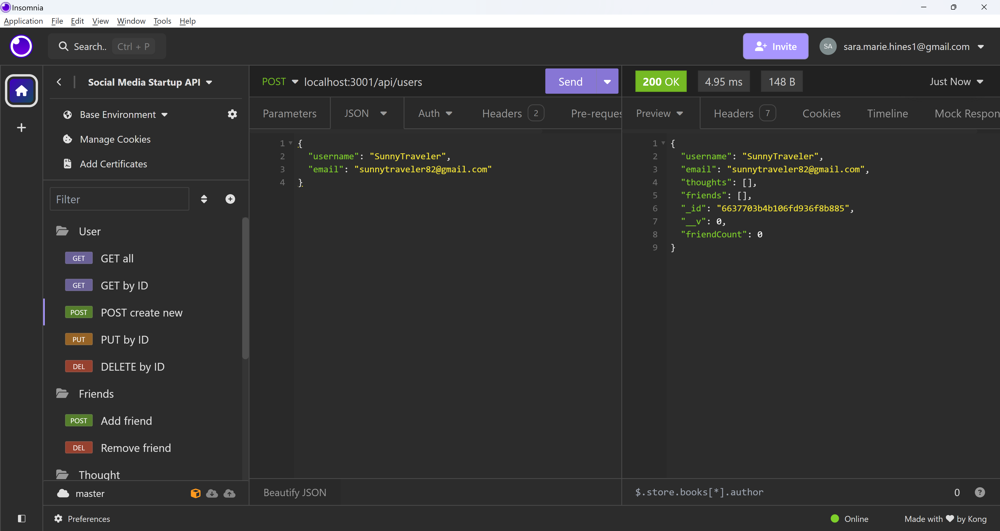

For the purpose of this demonstration, 4 additional users were created by the same method, using the 4 following JSON request bodies:

```
{
    "username": "NatureLover88",
	"email": "loverofnature88@yahoo.com"
}

{
    "username": "TechEnthusiast23",
	"email": "tech23@outlook.com"
}

{
    "username": "AdventureSeeker123",
	"email": "seeker123@protonmail.com"
}

{
    "username": "MountainExplorer56",
	"email": "mountainexplorer56@protonmail.com"
}
```

#### Read (GET) All Users

Send a GET request to `localhost:3001/api/users` to view all users. As can be seen in the below 2 screenshots, all 5 of the users were retrieved. 

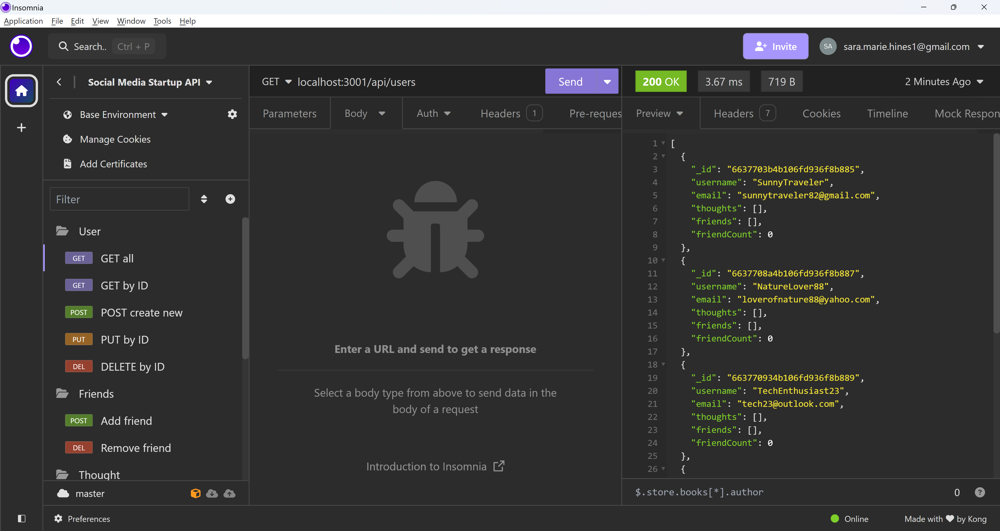

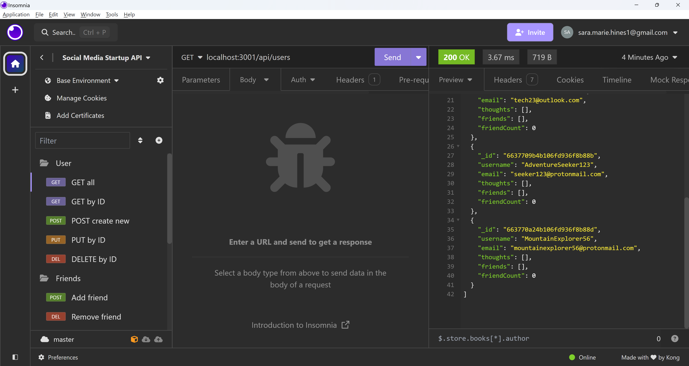

#### Read (GET) a Single User

Send a GET request to `localhost:3001/api/users/:userId` to view a single user. In the below screenshot, the _id of the user with username of SunnyTraveler was used as the userId parameter in the URI, and the user SunnyTraveler was successfully retrieved.

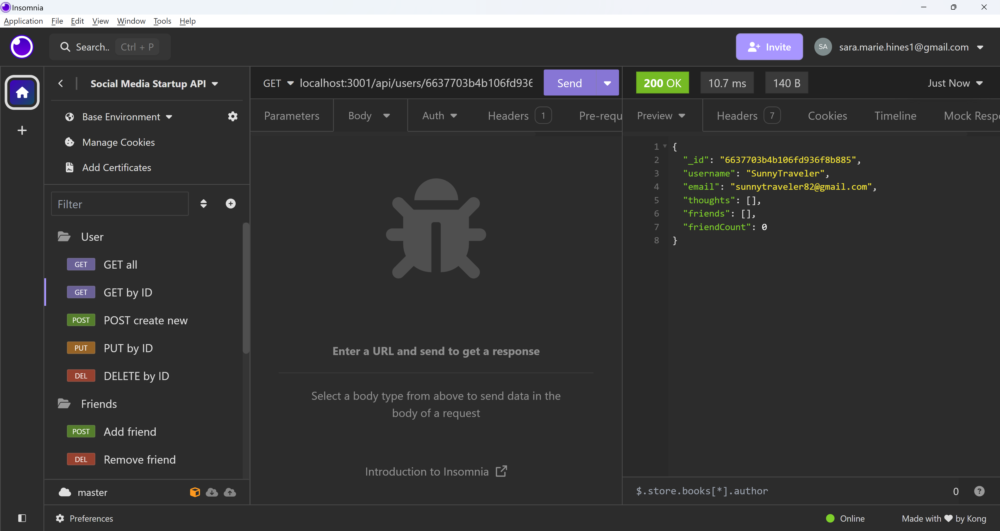

#### Update (PUT) a User

Send a PUT request to `localhost:3001/api/users/:userId` to update a user. Make sure to provide the username and email for the update in the JSON request body. In the below 2 screenshots, SunnyTraveler has been updated to have a username of OutdoorAdventurer99 and an email of adventurer99@gmail.com. When a GET request for all users is sent, the updated user appears as the first object in the response.

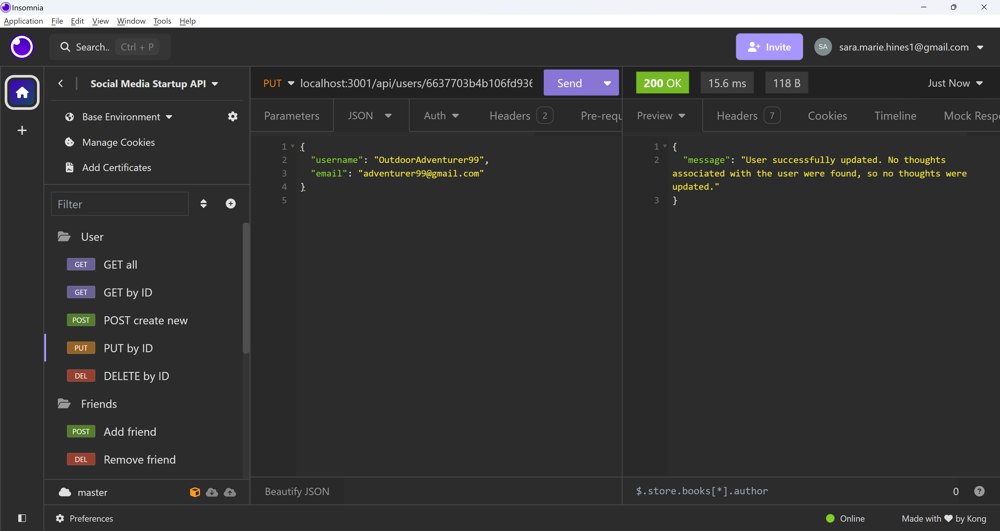
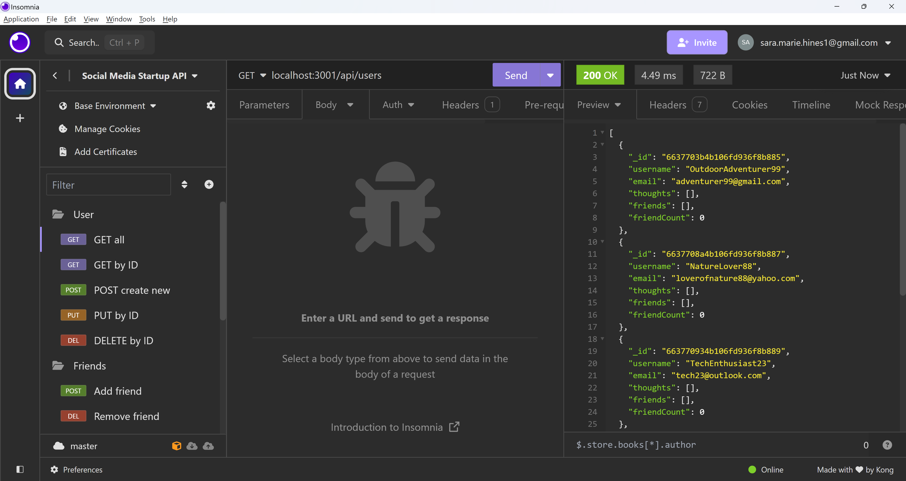

#### Delete (DELETE) a User

Send a DELETE request to `localhost:3001/api/users/:userId` to delete a user. In the below screenshot, the user with username MountainExplorer56 (the 5th user created from the POST route) is deleted by providing the user's _id as the request parameter. When a GET request for all users is sent again, MountainExplorer56 no longer appears.

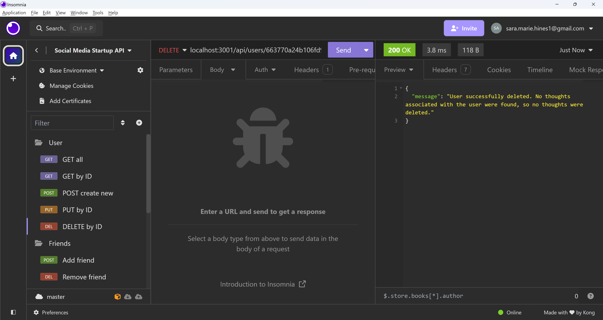


#### Add (POST) a Friend

Send a POST request to `/api/users/:userId/friends/:friendId` to add a friend to a user. The user _id of the user (userId) and the user _id of the friend to be added (friendId) are both provided as request parameters. In the below example, NatureLover88 is added as a friend to OutdoorAdventurer99 (as an ObjectId reference). Upon making a subsequent GET request to view OutdoorAdventurer99, NatureLover88 appears in OutdoorAdventurer99's friends array.

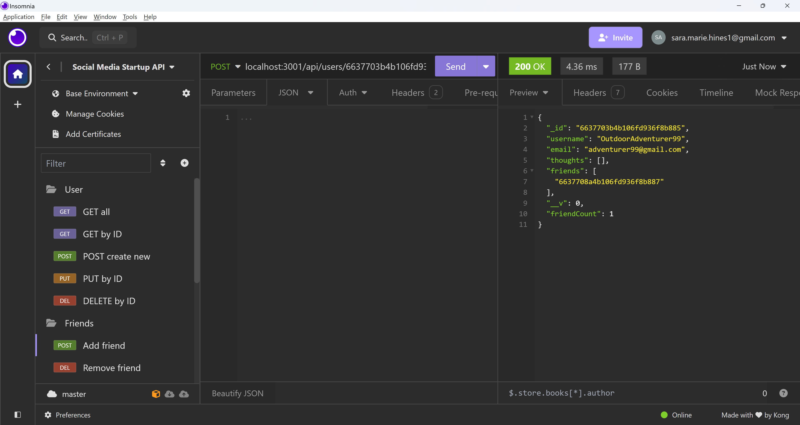
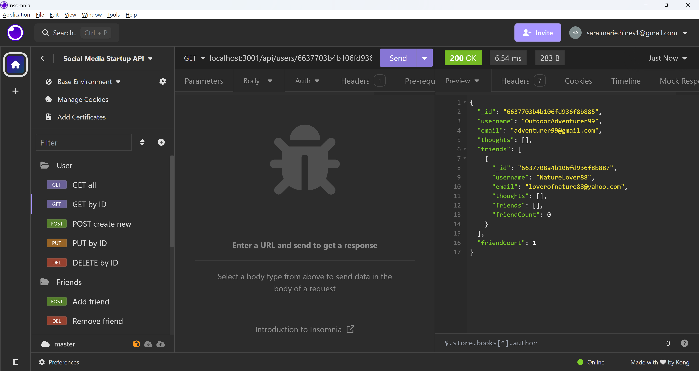

#### Remove (DELETE) a Friend

Send a DELETE request to `/api/users/:userId/friends/:friendId` to remove a friend from a user, where :userId is the _id of the user with the friend, and :friendId is the user _id of the friend to be removed. In the below screenshot, NatureLover88 is removed from OutdoorAdventurer99's friends, and OutdoorAdventurer99's friends array is now empty.

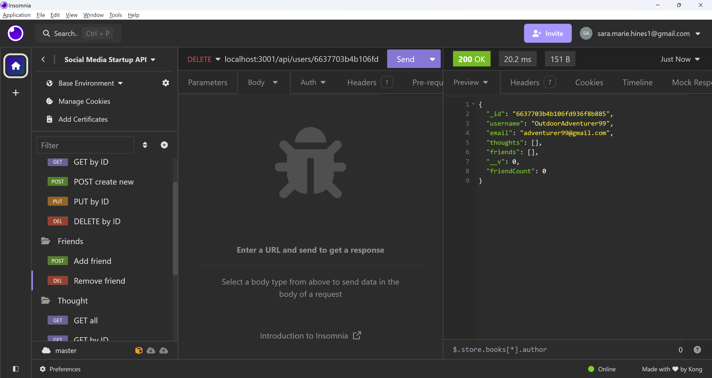

### Database Operations for Thoughts and Reactions

#### Create (POST) a Thought

Create a thought by sending a POST request to `localhost:3001/api/thoughts`. In the request body, include the userId of the user creating the thought, as well as the user's username and the thoughtText (the content of the thought). Two examples of creating a thought are shown below. 

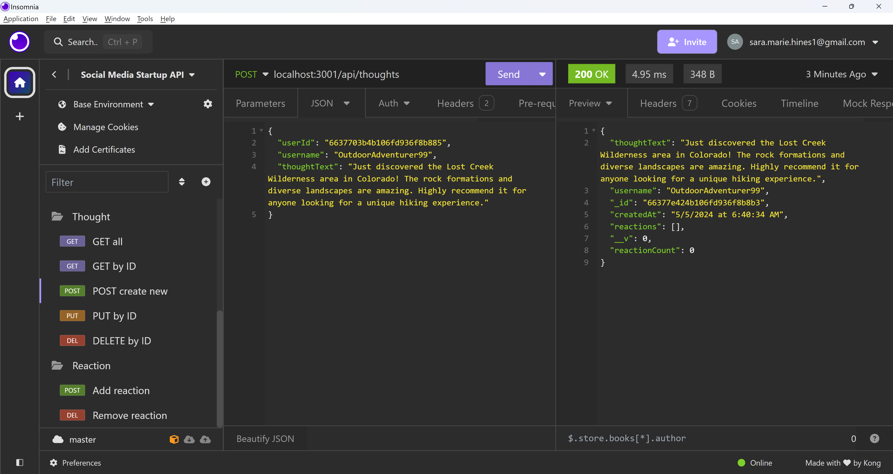
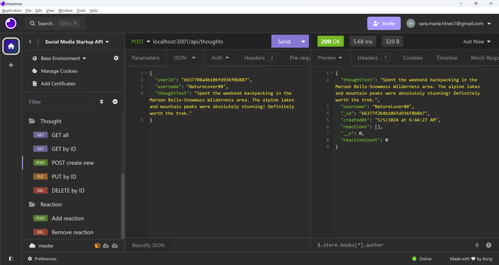

#### Read (GET) All Thoughts

To see all of the thoughts, send a GET request to `localhost:3001/api/thoughts`. The 2 thoughts created in the previous section are returned as results in the below screenshot.

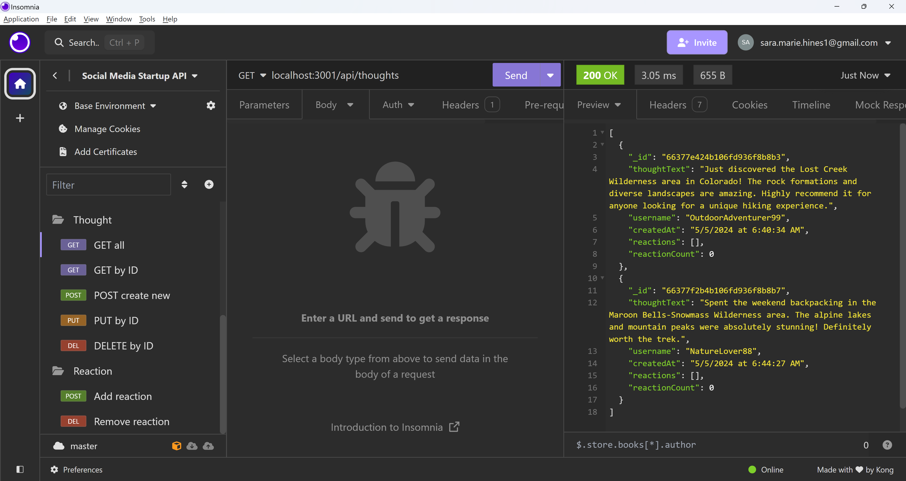

#### Read (GET) a Single Thought

A single thought can be retrieved by its _id by sending a GET request to `localhost:3001/api/thoughts/:thoughtId`. The below screenshot shows the successful retrieval of the first posted thought.

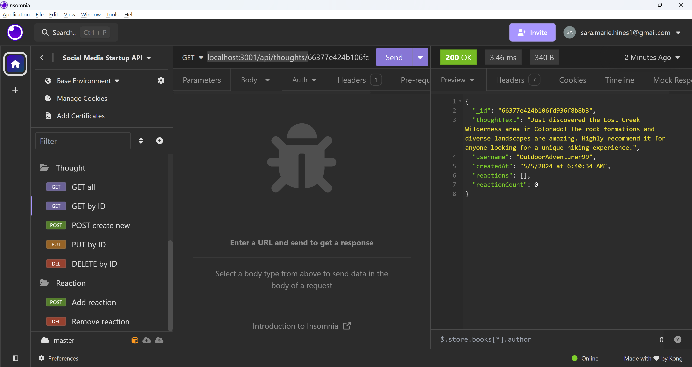

#### Update (PUT) a Thought

To update a thought, send a PUT request to `localhost:3001/api/thoughts/:thoughtId`. The request body can contain the thoughtText only, the username only, or the thoughtText and username. In the below example, the thoughtText is updated so that OutdoorAdventurer99's musings on the Lost Creek Wilderness become a Rocky Mountain National Park hike report instead.

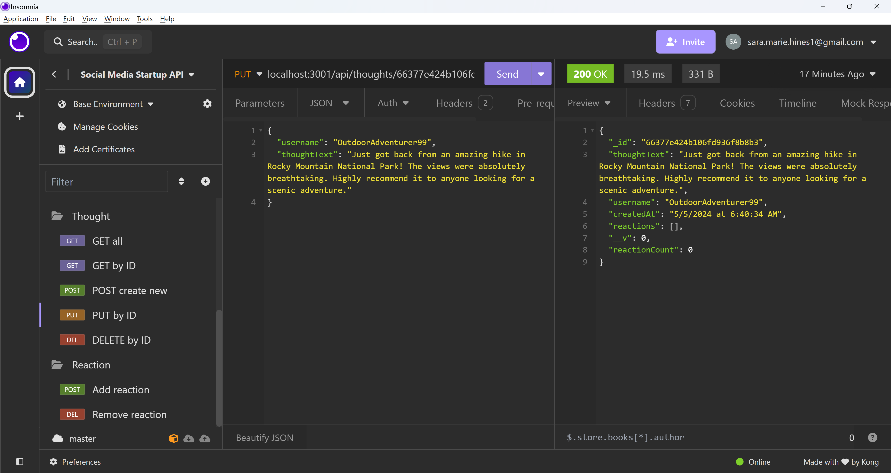

#### Delete (DELETE) a Thought

To delete a thought, send a DELETE request to `localhost:3001/api/thoughts/:thoughtId`. In the below screenshot, NatureLover88's thought on the Maroon Bells-Snowmass Wilderness is deleted. When making a subsequent GET request for all thoughts, NatureLover88's thought no longer appears.

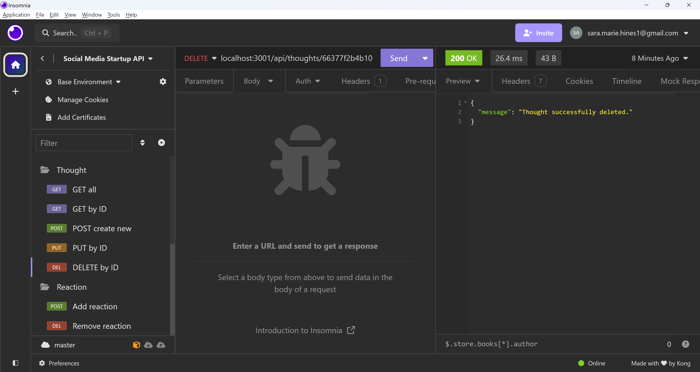


#### Add (POST) a Reaction

To add a reaction to a thought, send a POST request to `localhost:3001/api/thoughts/:thoughtId/reactions`. Make sure to use the _id of the thought you'd like to make a reaction to as the thoughtId request parameter. In your JSON body, include a reactionBody for the reaction and the username of the user creating the reaction. 

In the below screenshot, TechEnthusiast23 reacts to OutdoorAdventurer99's thought about Rocky Mountain National Park, and the reaction is visible in the reactions array of the OutdoorAdventurer99's thought.

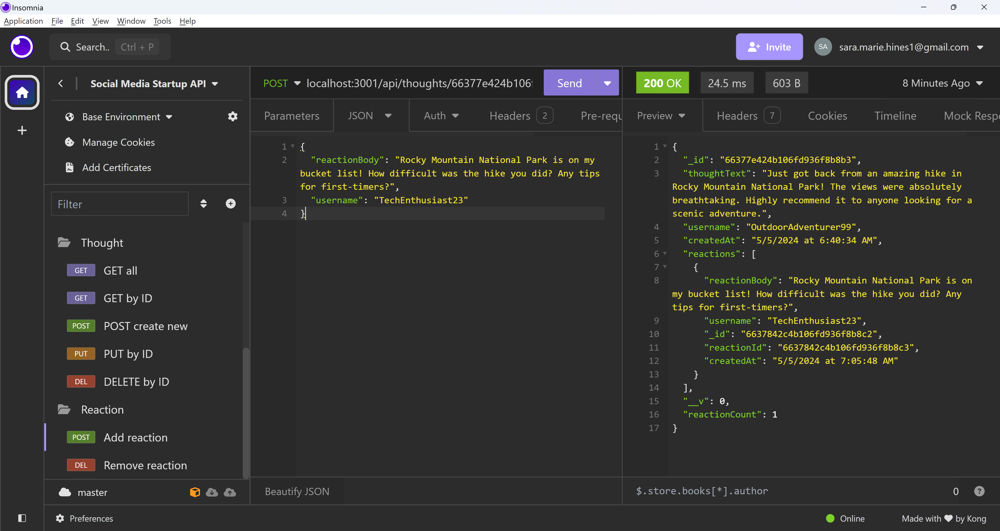

#### Remove (DELETE) a Reaction

To remove a reaction from a thought, send a DELETE request to `localhost:3001/api/thoughts/:thoughtId/reactions`. For the :thoughtId parameter, use the _id of the thought which currently has the reaction. In the JSON body, provide the reactionId of the reaction to be removed. 

In the below screenshot, TechEnthusiast23's reaction to OutdoorAdventurer99's thought about Rocky Mountain National Park is removed from the thought, and the response shows that the thought's reactions array is now empty.

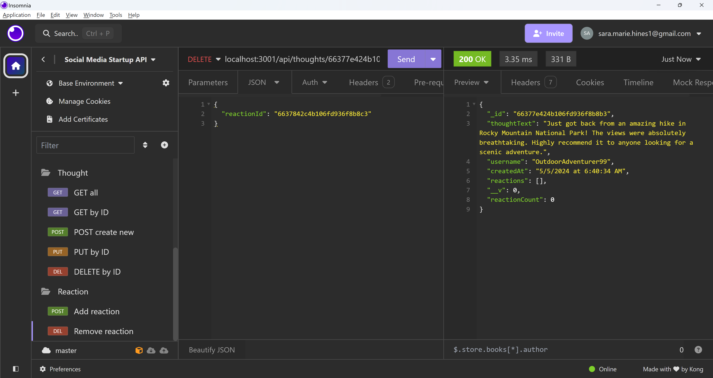

<p align="right">(<a href="#readme-top">back to top</a>)</p>


<!-- HIGHLIGHTED FEATURES -->
## Highlighted Features

### Update Thought on User Update

When a user is updated and their username is changed, if the user has created any thoughts, the username field of the user's thoughts is updated as well. 

The below 2 images show a successful update of our earlier example's OutdoorAdventurer99, now with the username ForestWanderer which shows under the Rocky Mountain National Park thought.

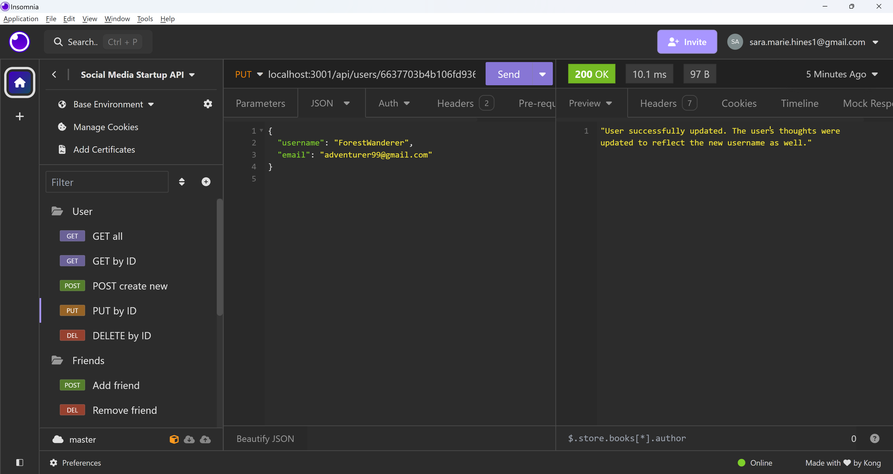
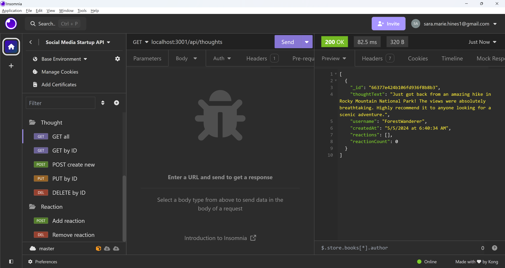

### Delete Thoughts on User Delete

When a user is deleted, any thoughts the user had created are deleted as well. 

To illustrate, a GET All Thoughts request returns 3 thoughts to start: ForestWanderer's thought about Rocky Mountain National Park, a thought made by CoastalExplorer about a Dipsea Trail hike, and a thought made by CoastalExplorer about the Big Sur Coastline. See the below screenshot for this GET request.

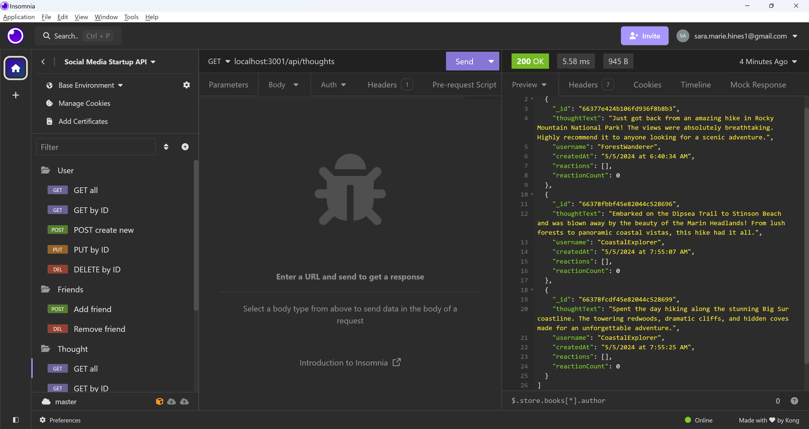

After deleting CoastalExplorer, we receive the following response message: 

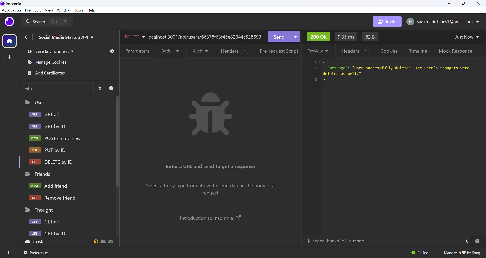

When making another GET request for all thoughts, we can see that CoastalExplorer's thoughts no longer appear.

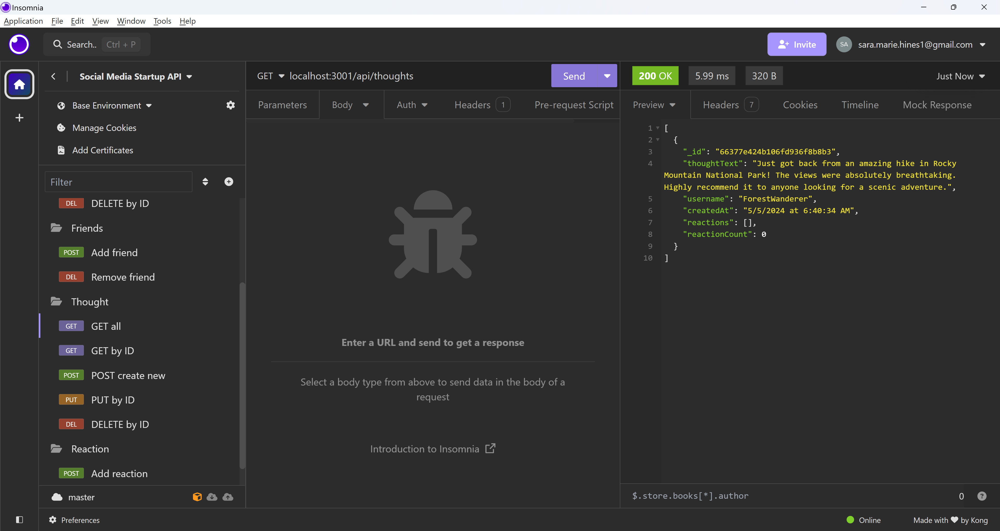

### Update User on Thought Delete

When a thought is deleted, the thought should no longer appear under the user who created it. So, when a thought is deleted, the user who created the thought is updated to reflect the change. 

To verify, ForestWanderer's thought about Rocky Mountain National Park is first deleted; ForestWanderer is then retrieved through a GET request, and the thought no longer appears in the thoughts array.

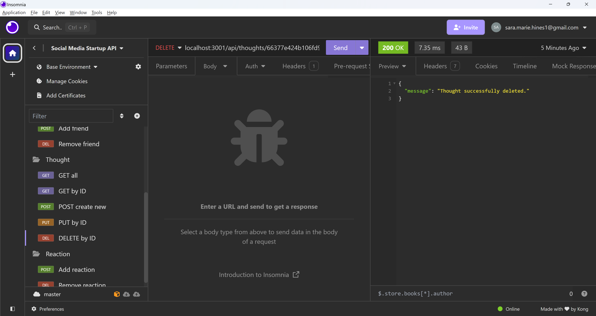

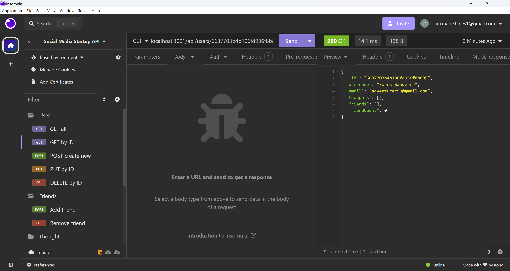

<p align="right">(<a href="#readme-top">back to top</a>)</p>


<!-- CONTRIBUTING -->
## Contributing

Contributions are what make the open source community such an amazing place to learn, inspire, and create. Any contributions you make are **greatly appreciated**.

If you have a suggestion that would make this better, please fork the repo and create a pull request. You can also simply open an issue with the tag "enhancement".

Don't forget to give the project a star! Thanks again!

1. Fork the Project
2. Create your Feature Branch (`git checkout -b feature/AmazingFeature`)
3. Commit your Changes (`git commit -m 'Add some AmazingFeature'`)
4. Push to the Branch (`git push origin feature/AmazingFeature`)
5. Open a Pull Request

<p align="right">(<a href="#readme-top">back to top</a>)</p>


<!-- LICENSE -->
## License

This project is covered under the MIT License. You can learn more about this license and its coverage and permissions [here](https://opensource.org/licenses/MIT).

<p align="right">(<a href="#readme-top">back to top</a>)</p>


<!-- CONTACT -->
## Contact

If you have any questions/thoughts about this project or would like to connect, you can reach me at https://github.com/sara-hines/ or sara.marie.hines1@gmail.com. I look forward to hearing from you!

<p align="right">(<a href="#readme-top">back to top</a>)</p>


<!-- ACKNOWLEDGMENTS -->
## Acknowledgments

This README was made from a modified template created by [@othneildrew](https://github.com/othneildrew). View the original [here](https://github.com/othneildrew/Best-README-Template).

I referenced Isaac S. Weaver's Mar 25, 2020 answer for validating emails in mongoose: 

    (2022, September 18). Mongoose - Validate email syntax. Stack Overflow. https://stackoverflow.com/questions/18022365/mongoose-validate-email-syntax

<p align="right">(<a href="#readme-top">back to top</a>)</p>


<!-- MARKDOWN LINKS & IMAGES -->
<!-- https://www.markdownguide.org/basic-syntax/#reference-style-links -->
<!-- [contributors-shield]: https://img.shields.io/github/contributors/sara-hines/social-media-startup-api.svg?style=for-the-badge
[contributors-url]: https://github.com/sara-hines/social-media-startup-api/graphs/contributors
[forks-shield]: https://img.shields.io/github/forks/sara-hines/social-media-startup-api.svg?style=for-the-badge
[forks-url]: https://github.com/sara-hines/social-media-startup-api/network/members
[stars-shield]: https://img.shields.io/github/stars/sara-hines/social-media-startup-api.svg?style=for-the-badge
[stars-url]: https://github.com/sara-hines/social-media-startup-api/stargazers
[issues-shield]: https://img.shields.io/github/issues/sara-hines/social-media-startup-api.svg?style=for-the-badge
[issues-url]: https://github.com/sara-hines/social-media-startup-api/issues
[license-shield]: https://img.shields.io/github/license/sara-hines/social-media-startup-api.svg?style=for-the-badge
[license-url]: https://github.com/sara-hines/social-media-startup-api/blob/master/LICENSE.txt -->
[MongoDB]: https://img.shields.io/badge/MongoDB-%234ea94b.svg?style=for-the-badge&logo=mongodb&logoColor=white
[Mongo-url]: https://www.mongodb.com
[Mongoosejs]: https://img.shields.io/badge/Mongoose-880000?style=for-the-badge&logo=mongoose&logoColor=white
[Mongoose-url]: https://mongoosejs.com/
[Express.js]: https://img.shields.io/badge/express.js-%23404d59.svg?style=for-the-badge&logo=express&logoColor=%2361DAFB
[Express-url]: https://expressjs.com/
[Node.js]: https://img.shields.io/badge/node.js-6DA55F?style=for-the-badge&logo=node.js&logoColor=white
[Node-url]: https://nodejs.org
[Insomnia.rest]: https://img.shields.io/badge/Insomnia-black?style=for-the-badge&logo=insomnia&logoColor=5849BE
[Insomnia-url]: https://insomnia.rest/
[JavaScript]: https://img.shields.io/badge/javascript-%23323330.svg?style=for-the-badge&logo=javascript&logoColor=%23F7DF1E
[Javascript-url]: https://ecma-international.org/publications-and-standards/standards/ecma-262/
[Nodemon.io]: https://img.shields.io/badge/NODEMON-%23323330.svg?style=for-the-badge&logo=nodemon&logoColor=%BBDEAD
[Nodemon-url]: https://nodemon.io/
[Visualstudio.com]: https://img.shields.io/badge/Visual%20Studio%20Code-0078d7.svg?style=for-the-badge&logo=visual-studio-code&logoColor=white
[VSCode-url]: https://code.visualstudio.com/